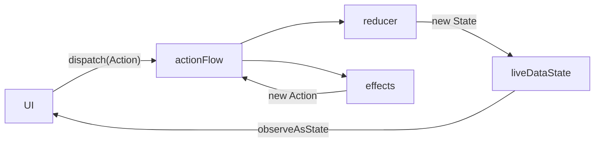

# uni

[](https://github.com/ekeitho/uni/actions/workflows/android.yml)
[](https://central.sonatype.com/artifact/com.ekeitho.uni/uni)

A tiny unidirectional data flow architecture for Android, built on Kotlin coroutines
`Flow`, `LiveData`, and the Jetpack `ViewModel`. It follows the same idea as Redux and
MVI: your screen has a single immutable `State`, the UI sends `Action`s, a pure `reducer`
turns those actions into the next state, and `effect`s handle the async work (network,
database, timers) by mapping actions back into more actions.

The whole library is a few hundred lines. There is no annotation processor, no code
generation, and no required DI framework.

## Core concepts

| Concept | What it is |
|---------|------------|
| **State** | An immutable snapshot of everything the screen needs to render. Usually a `data class`. |
| **Action** | Something that happened: a tap, a response coming back, a timer firing. Usually a `sealed class`. |
| **reducer** | A pure function `(action, state) -> state`. The only place state changes. No side effects. |
| **effect** | A function `Flow<Action> -> Flow<Action>`. It watches the actions flowing through the ViewModel and produces new actions, which is where async work lives. |

## How data flows

Data only moves in one direction. The UI dispatches an action, the reducer produces the
next state, and the UI re-renders from that state. Effects listen to the same action
stream and can feed new actions back in, which loop through the same path.



Two important details:

- `dispatch` is serialized with a `Mutex`, so actions are processed one at a time and the
  state is never updated from two places at once.
- A single action can update the state more than once. The reducer runs for the original
  action, and then any effect listening for that action can emit a follow up action that
  reduces again.

## Install

uni is on Maven Central.

```groovy
// build.gradle
implementation "com.ekeitho.uni:uni:$uni_version"
```

```kotlin
// build.gradle.kts
implementation("com.ekeitho.uni:uni:$uniVersion")
```

Check the Maven Central badge above for the latest version.

## Quick start

Define your `State`, your `Action`s, and build a ViewModel with the `uniViewModelDSL`
builder. Here is a screen that loads a random Wikipedia article.

```kotlin
data class Wiki(private val wikiService: WikiService) {

    data class State(val wikiResponse: WikiResponse? = null)

    sealed class Action {
        object FetchRandomWikiAction : Action()
        data class WikiResponseAction(val wikiResponse: WikiResponse) : Action()
    }

    fun getViewModel() =
        uniViewModelDSL<State, Action>(State()) {
            effect { flow ->
                flow
                    .filterIsInstance<Action.FetchRandomWikiAction>()
                    .flatMapLatest {
                        wikiService.getRandomWiki().map { Action.WikiResponseAction(it) }
                    }
            }

            reducer { action, state ->
                when (action) {
                    is Action.WikiResponseAction -> state.copy(wikiResponse = action.wikiResponse)
                    is Action.FetchRandomWikiAction -> state.copy(wikiResponse = null)
                }
            }
        }
}
```

What happens when the user taps the button:

1. The UI calls `dispatch(Action.FetchRandomWikiAction)`.
2. The reducer clears the current response, so the UI can show a loading spinner.
3. The effect sees `FetchRandomWikiAction`, calls the network, and emits
   `WikiResponseAction` when the result comes back.
4. The reducer stores the response, and the UI re-renders with the article.

## Using it in Compose

The ViewModel exposes `liveDataState`, so observe it with `observeAsState` and call
`dispatch` from your event handlers. Any DI framework works; this example uses Koin's
`getViewModel`.

```kotlin
setContent {
    val vm = getViewModel<DslUnidirectionalViewModel<Wiki.State, Wiki.Action>>()
    val state by vm.liveDataState.observeAsState(initial = Wiki.State())

    WikiScreen(
        wikiResponse = state.wikiResponse,
        onButtonTap = {
            vm.dispatch(Wiki.Action.FetchRandomWikiAction)
        }
    )
}
```

## Effects

An effect is just a function from `Flow<Action>` to `Flow<Action>`, so you have the full
coroutines `Flow` operator set: `filterIsInstance`, `flatMapLatest`, `debounce`, `map`,
and so on. A ViewModel can register as many effects as you want.

Effects can also chain. Because every action an effect emits goes back through the same
action stream, one effect can react to the output of another:

```kotlin
uniViewModelDSL<State, Action>(State()) {
    // First effect: UpdatePageNum -> SideEffectNum
    effect { flow ->
        flow.filterIsInstance<Action.UpdatePageNum>()
            .map { Action.SideEffectNum(it.num + 3) }
    }

    // Second effect: reacts to the action the first effect produced
    effect { flow ->
        flow.filterIsInstance<Action.SideEffectNum>()
            .map { Action.TestNum(it.num + 3) }
    }

    reducer { action, state -> /* ... */ }
}
```

## Bring your own ViewModel type

If you need a unique type in your DI graph, or you want to inject extra dependencies,
extend `DslUnidirectionalViewModel` and pass your instance to the builder overload.

```kotlin
class MyViewModel(
    private val repo: MyRepository,
) : DslUnidirectionalViewModel<MyState, MyAction>(MyState())

fun build(repo: MyRepository) =
    uniViewModelDSL(MyViewModel(repo)) {
        effect { /* ... */ }
        reducer { action, state -> /* ... */ }
    }
```

You can also extend the abstract `UniViewModel` class directly if you prefer overriding
`reduce` and `sideEffects` to the DSL.

## Threading

Effects run on a `CoroutineDispatcher` you pass to the builder. It defaults to
`Dispatchers.IO`, which keeps network and database work off the main thread. You can
override it, which is handy in tests where you want to control execution:

```kotlin
uniViewModelDSL<State, Action>(State(), Dispatchers.Main) {
    // ...
}
```

State reduction and `liveDataState` updates happen through the `ViewModel`'s own scope so
the UI observes them on the main thread.

## Contributing

Issues and pull requests are welcome. See [CONTRIBUTING.md](CONTRIBUTING.md) for how to
build, test, and submit changes.

## License

uni is released under the MIT License. See [LICENSE](LICENSE) for the full text.
